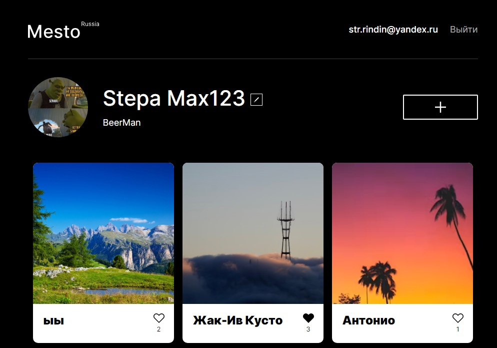

# Проект: Mesto React Authorization

Mesto - это социальная сеть для обмена фотографиями, реализованная в виде одностраничного приложения.

Особенностью этого проекта является то, что я добавил возможность авторизации.

## Технологии и инструменты 🛠️:

## Функционал

- Регистрация и авторизация
- 🤝: Адаптивный макет
- 📁: Структура проекта, построенная в соответствии с BEM (вложенный тип)
- ✏️: Отредактируйте и сохраните профиль (имя, описание и аватар)
- ➕: Добавьте новые открытки
- ♥️: Поставьте лайк
- 🗑️: Удалите открытки (только для владельцев)
- 💬: Приложение запрашивает подтверждение перед удалением
- 🖼️ Карточки открываются во всплывающих окнах
- 🚪 Закройте карточку клавишей Esc, нажав overlay или кнопку закрытия

## Установка проекта

1. `git@github.com:opigon1/mesto-react-authorization.git` - клонировать репозиторий (HTTPS) на свое устройство
2. `npm i` - установить зависимости
4. `npm run start` - запустить приложение в режиме разработчика

## Статус проекта: Завершён
